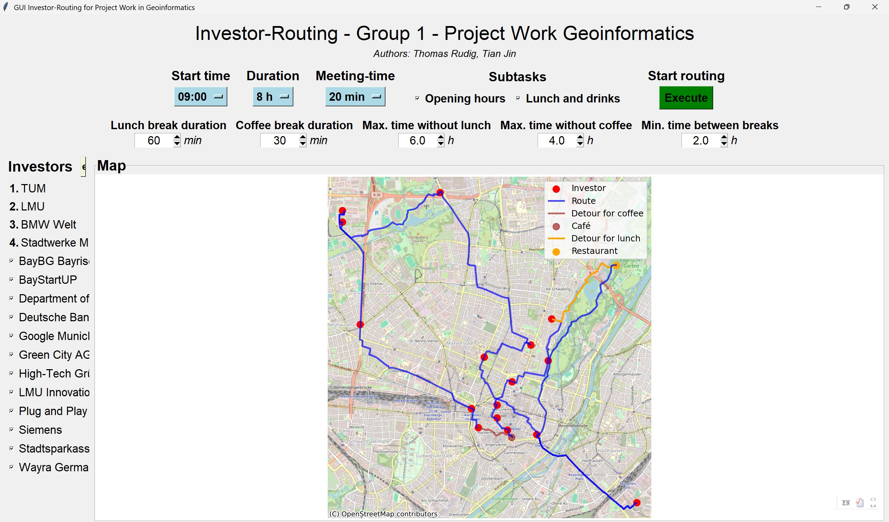

# Project Work in Geoinformatics – Report (SuSe25)

* Thomas Rudig 
* Tian Jin 

## 0. Introduction

This project focuses on planning the most time- and energy-efficient route to visit potential investors in Munich for our start-up, which aims to commercialize a novel CO₂-based energy generator.

The developed Python application uses multiple datasets, integrates routing algorithms, and provides an interactive GUI for user control and visualization.

To run the project:
1. Ensure required `.geojson` files are in the correct directory.
2. Run the script `GUIandProject.py`.
3. Use the GUI to select investors, set time parameters, and launch routing.

## 1. Task Description

### 1.1 General Task

The task is framed by a staged scenario, where a group of employees represent their new start-up aiming to commercialize a novel CO2-based energy generator. To secure funding, the group plans the most time- and energy-efficient round trip to visit hypothetical investors in Munich and pitch their ideas.

The project is divided into two stages: Level 0 and Level 1.

Level 0 serves as the base, where an algorithm is developed to connect all selected investors into the most efficient round trip, using multiple transport modes such as walking, public transport, bicycles, or e-cars.

Level 1 builds on this by adding specialized subtasks chosen by team members to extend the functionality. In our project, Subtask A (Opening Hours) was implemented by Thomas Rudig, and Subtask F (Lunch and Drinks) was implemented by Tian Jin.

The following sections provide a detailed discussion of the necessary preparations, the implementation of Level 0, and the selected subtasks.

### 1.2 Time Plan

The search for data was divided among the group members, with each person responsible for gathering different datasets relevant to the project.

The development of Level 0 was a collaborative group effort to ensure cohesion and shared understanding of the routing foundation. For Level 1, the specialized subtasks were implemented individually, allowing each member to apply their own strategies and focus, before merging the results back into the group’s joint codebase.

The design and implementation of the graphical user interface (GUI) was also a collaborative task, ensuring that all team members were familiar with its structure and functionalities.

For the presentations and final report, the work was divided among the group members, with everyone contributing slides or sections. The strong collaboration throughout ensured that all members were actively involved and contributed to the final deliverables.

## 2. Implementation
### 2.1 Preparation
#### 2.1.1 Data aquisition

The project’s data acquisition involved several key components.
The locations and attributes of investors were provided through .geojson files, which included name, coordinates, category, and where available, opening hours. For missing opening hour data, we applied default values (09:00–18:00).

For the routing network, we used OpenStreetMap data, downloaded and processed using the osmnx Python package, focusing on the pedestrian network (network_type='walk') of Munich.

Additionally, for Subtask F (Lunch & Drinks), we incorporated two extra .geojson datasets: one containing restaurant locations and another with cafés across Munich, to allow the program to dynamically schedule lunch and coffee breaks during the trip.

#### 2.1.2 Investors
The specific investors can be found in the project. The Investors include different groups including the following:

* *Finance/Banks*: These investors specialize in funding young and high-growth companies. They offer capital along with strategic support and networks.
* *Companies*: These investors make strategic investments in startups to foster innovations and technological advancements that can complement their own business areas. They also provide startups not only with capital but also with workspaces and mentoring.
* *Universities*: These institutions invest in research and development and support projects that drive scientific and technological progress.
* *Government Agencies*: These investors promote regional economic development and innovation through financial support and infrastructure initiatives.
The four mandatory stops were fixed and pre-sorted based on the order_of_visit attribute in the .geojson file. Optional investors were sorted alphabetically and could be selected via the GUI.

For each investor, the program extracted the following key information:

Name

Coordinates (longitude, latitude)

Category

Opening hours (with fallback defaults)

This allowed the system to flexibly adjust routes depending on which investors were selected and when they were open.

#### 2.1.3 Algorithm decision
To compute the most efficient round trip between the selected investors, we used Dijkstra’s algorithm from the networkx library. The underlying pedestrian network of Munich was extracted using osmnx, allowing the program to calculate realistic shortest paths based on actual street data.

Our implementation focused on a dynamic and pragmatic approach. The four mandatory investors were visited in their predefined order, ensuring that the project requirements were met. The optional investors were sorted alphabetically and could be interactively selected through the graphical user interface.

Throughout the routing process, the program simulated the passage of time, accounting for travel durations, meeting times, and waiting periods when arriving before an investor’s opening hours. Additionally, the integration of subtasks such as planning lunch and coffee breaks was handled within this time loop, allowing the system to adapt the schedule realistically without adding unnecessary computational complexity.

#### 2.1.4 Chosen GUI Library
For the graphical user interface, we chose to use the `tkinter` library. It provided a simple yet effective framework to build an interactive application with input fields, option menus, checkboxes, and action buttons.

To visualize routing results, we embedded `matplotlib` plots into the GUI using `FigureCanvasTkAgg`, allowing users to see the calculated routes directly on a map.

The decision to use `tkinter` was based on its balance of simplicity, flexibility, and good documentation, making it accessible for all team members to work on and understand.

#### 2.1.5 Chosen Python Libraries
A variety of Python libraries were used to achieve the goals of this project. In particular, the GUI required several to make it look and work as intended.

* *tkinter* — to provide basic GUI components, such as buttons, labels, menus.

* *matplotlib.pyplot* — to generate plots that were embedded into the GUI for live map visualizations.

* *geopandas* — to work with geospatial data, especially reading .geojson files and plotting spatial objects.

* *contextily* — to add basemap tiles to the plotted maps, improving geographic context.

* *osmnx* — to download, manage, and process the Munich street network from OpenStreetMap.

* *networkx* — to perform graph operations like Dijkstra’s shortest path algorithm.

* *pandas* — to manage and manipulate tabular data where needed.

* *threading* — to run long calculations without freezing the GUI interface.

### 2.2 Level 0
The goal of Level 0 was to create a working routing system connecting all selected investors into an efficient round trip.
For this, we first used .geojson files to load the names, coordinates, and optional opening hours of each investor. These data points were then linked to the Munich pedestrian network graph obtained through osmnx.

To calculate the shortest paths, the program used Dijkstra’s algorithm from the networkx library, operating over the street network graph.
The GUI allowed the user to set time parameters such as start time, total available hours, and meeting duration. It also enabled selecting which optional investors to include beyond the four mandatory stops.

Once the initial routing was calculated, the system simulated the entire day. It accounted for time spent traveling between locations, time spent in meetings, and—if necessary—time waiting for an investor to open. The visualization of the route, including detours, was dynamically plotted on a map embedded into the GUI, allowing the user to see the calculated path, points of interest, and additional stops.

### 2.3 Level 1 Subtasks
#### 2.3.1 Subtask A: Opening Hours
This subtask was fully implemented and played a key role in making the routing realistic.
The program checked the opening hours of each investor before visiting. If no opening hours were provided, the system assumed default values of 09:00 to 18:00.

When the route planning reached an investor outside of its opening hours, the program decided whether to wait or to skip that investor depending on the available time left in the day.
This added a layer of complexity, as the routing was no longer just a matter of distance but also of time feasibility.

#### 2.3.2 Subtask F: Lunch and Drinks
This subtask focused on inserting coffee and lunch breaks into the planned route to reflect realistic daily constraints.
The program tracked how long the user had been traveling without a break. If a predefined threshold (e.g., maximum time without lunch or coffee) was exceeded, the program dynamically searched for the nearest restaurant or café from the additional .geojson datasets.

Once a suitable location was found, the route included a detour, added the necessary break time, and updated the remaining day’s schedule accordingly.
This made the day plan more realistic and ensured the route considered both logistical and human needs.

## 3. Results

The program produces:

- An optimized route between selected investors, considering distance, time, and feasibility.

- Time management that includes breaks and waiting times, adapting the schedule dynamically.

- A visual map with plotted routes, stops, detours, cafés, and restaurants, making it easy to understand and present.

From the test runs, the system achieved the following:

- Visited up to ~15 investors per day, depending on start time and selected parameters.

- Adjusted dynamically to opening times, waiting or skipping if necessary.

- Inserted lunch and coffee breaks at reasonable intervals, using nearby cafés and restaurants found from additional data sources.

The final output was displayed as an interactive GUI showing detailed statistics, such as total travel time, time spent waiting, meeting durations, and break times.

### Screenshots

## 4. Problems and Lessons Learned

- Handling missing or inconsistent data, such as missing or malformed opening hour entries in .geojson files, required robust default handling.

- Ensuring GUI responsiveness during heavy calculations was solved by implementing threading, which allowed routing tasks to run without freezing the interface.

- Understanding real-world constraints, like the importance of including human needs (lunch, coffee, rest) and respecting time windows, was essential to making the tool realistic.

- The importance of early integration between GUI and backend logic became clear, as working on these parts in isolation made later merging more time-consuming.

## 5. References

- Bundesnetzagentur Charging Stations: https://www.bundesnetzagentur.de/
- MVV/MVG Public Transport Data: https://www.mvg.de/
- Bavarian Surveying Administration DGM: https://geodaten.bayern.de/
- osmnx documentation: https://osmnx.readthedocs.io/
- contextily documentation: https://contextily.readthedocs.io/
